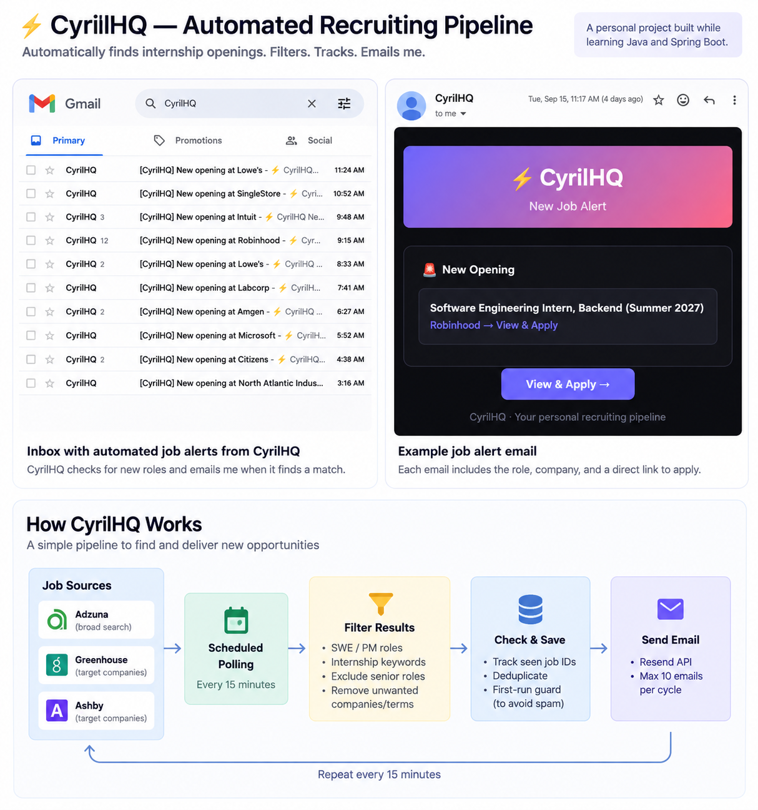

# CyrilHQ —> Automated Recruiting Pipeline

CyrilHQ is a personal recruiting tool I built to automate part of my Summer 2027 internship search.

Instead of repeatedly checking job boards, the backend checks multiple job sources every 15 minutes, filters the results for roles I'm interested in, tracks jobs it has already seen, and emails me when it finds a new opening.

## CyrilHQ in Action



CyrilHQ checks job sources every 15 minutes, filters relevant openings, tracks jobs it has already seen, and emails me when it discovers a new match.

## How It Works

Greenhouse and Ashby are used to monitor job boards for companies I'm specifically targeting. Adzuna widens the search beyond that list and helps discover additional Software Engineering and Product Management internship postings.

The pipeline runs automatically every 15 minutes:

**Job Sources → Scheduled Polling → Filter Results → Check Previously Seen Jobs → Save New Jobs → Email Alert**

## What It Does

- Checks job sources every 15 minutes.
- Searches Adzuna for Software Engineering and Product Management internship roles.
- Monitors selected company job boards through Greenhouse and Ashby.
- Filters out senior-level roles and other postings I don't want.
- Tracks external job IDs in a database so the same opening is not alerted twice.
- Uses a first-run safeguard so starting the backend does not immediately email every existing job.
- Sends new-job alerts through the Resend API.
- Caps alerts at 10 emails per polling cycle.

## Tech Stack

**Backend:** Java, Spring Boot, Spring Data JPA  
**Frontend:** React, Vite  
**Job Sources / APIs:** Adzuna, Greenhouse, Ashby  
**Email:** Resend API  
**Deployment:** Railway, Vercel

## Running Locally

### Requirements

- Java 21
- Maven
- Node.js 18+

### Backend

The backend requires API credentials for the services you want to use. Keep API keys in environment variables rather than committing them to GitHub.

```bash
cd backend
mvn spring-boot:run
```

The backend runs on `http://localhost:8080`.

### Frontend

```bash
cd frontend
npm install
npm run dev
```

The frontend runs on `http://localhost:5173`.

## Deployment

The frontend is deployed with Vercel and the Spring Boot backend is deployed with Railway.

## Why I Built It

Internship recruiting involves repeatedly checking company career pages and job boards. I wanted a simple way to automate some of that work while applying what I was learning about Java and backend development.

CyrilHQ started as a recruiting dashboard, but the more useful part became the automated job pipeline behind it: fetch jobs, filter them, remember what has already been seen, and notify me when something new appears.

I built this project while learning Java and Spring Boot to practice working with external APIs, scheduled tasks, database persistence, filtering, and email automation.

This is a personal learning project, not a large-scale recruiting platform. I built it to solve a problem I actually had and to get more hands-on experience with backend development.

---

Built by [Cyril Annoh](https://www.linkedin.com/in/cyril-annoh/) · NYC College of Technology (CUNY)
