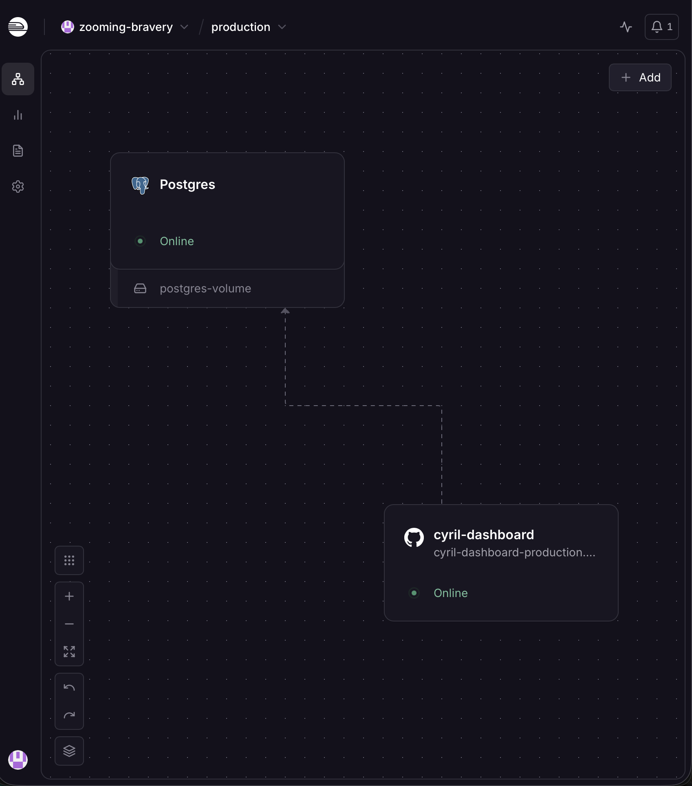
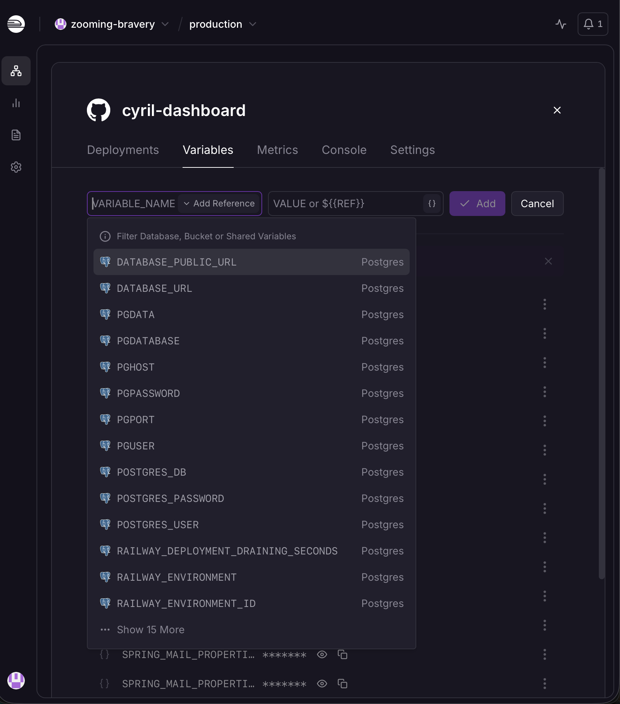
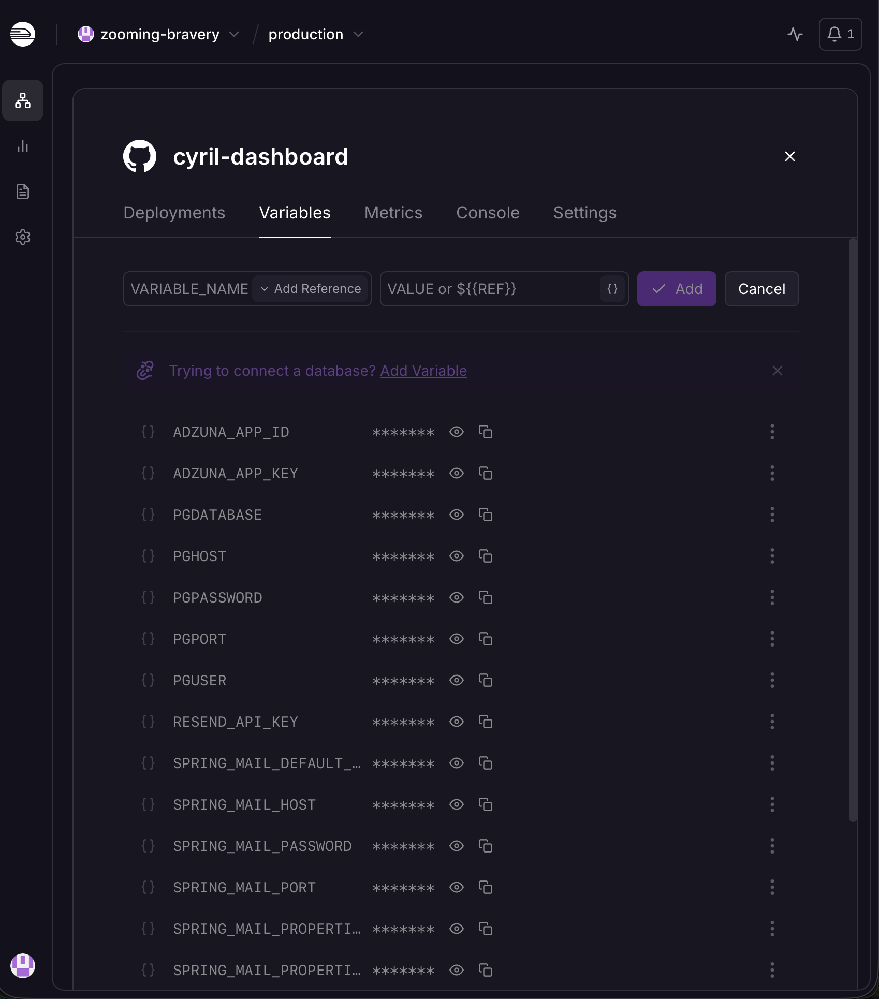

# 🚨 Job Alerts Setup

This feature checks your target companies' job boards every 15 minutes, plus a wider search
across the internet, and emails you the second a new Software Engineer role goes live.

## How it works

- **Direct company polling** — for companies you specifically add, the app talks straight to
  their hiring platform (Greenhouse or Ashby) via a public API. Fast and precise, but only covers
  companies you've manually listed.
- **Wide discovery search** — uses the free [Adzuna](https://developer.adzuna.com/) job search
  API to catch postings from companies you haven't added. Broader, but not exhaustive — no free
  API covers every job posted anywhere.

## Setup

### 1. Add a free database

The app needs somewhere to remember which jobs it's already told you about, so you don't get
the same alert twice.

1. In your Railway project (**the same project your backend already lives in** — don't create a
   separate one, Railway's variable linking only works within one project), click
   **+ New → Database → Add PostgreSQL**

   

2. Go into your backend service → **Variables** tab → **New Variable** → use **Add Reference** to
   link these five values from the Postgres service:
   `PGHOST`, `PGPORT`, `PGDATABASE`, `PGUSER`, `PGPASSWORD`

   

3. Redeploy — the app sets up what it needs in the database automatically on first boot

   

### 2. Get a free Adzuna API key

1. Register for free at [developer.adzuna.com](https://developer.adzuna.com/)
2. Copy your `app_id` and `app_key`
3. Add them as environment variables in Railway:
ADZUNA_APP_ID=your_app_id_here
ADZUNA_APP_KEY=your_app_key_here

### 3. Add your target companies

Open `backend/src/main/java/com/dashboard/jobs/CompanyAtsConfig.java`. Each company needs:
- Its name
- Which hiring platform it uses (`GREENHOUSE` or `ASHBY`)
- Its board token — found in the company's careers page URL:
  - Greenhouse: `job-boards.greenhouse.io/companyname` → token is `companyname`
  - Ashby: `jobs.ashbyhq.com/companyname` → token is `companyname`

## What happens the first time it runs

The first check for any company you add silently records every currently-open job without
emailing you — otherwise you'd get flooded with alerts for jobs that were already posted before
you added the company. After that first pass, you'll only get emailed for genuinely new postings.

## Catching general internships (not just "software engineer" titles)

By default, the filter looks for "software engineer," "swe," or "developer" in the title, and
skips senior-level roles. To also catch postings like "2027 Engineering Intern" that don't say
"software engineer" specifically, open `GreenhousePoller.java` and `AshbyPoller.java` and change:

```java
boolean isSwe = t.contains("software engineer") || t.contains("swe") || t.contains("developer");
```

to:

```java
boolean isSwe = t.contains("software engineer") || t.contains("swe") 
              || t.contains("developer") || t.contains("intern");
```

Just know this will also catch non-engineering internships (marketing, sales, etc.), since
companies don't always specify a department in the title.

## Limits and honest expectations

- Adzuna is a large aggregator, not a complete index of every job on the internet — it misses
  LinkedIn-only postings, some direct-apply-only companies, and has a real crawl lag.
- A hard cap of 10 emails per 15-minute cycle is built in, so a bug or a company with a huge
  backlog can never flood your inbox again.
- Resend's free tier caps at 100 emails/day. If you hit that, alerts pause until it resets.